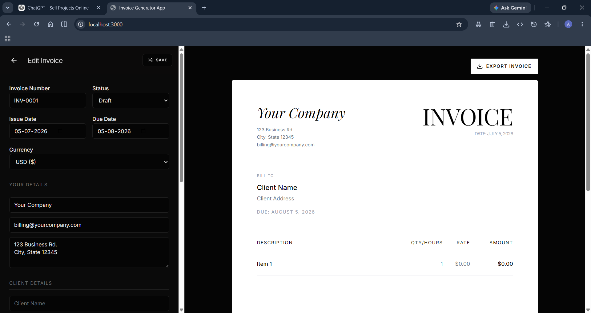

# Invoice-Generator
Modern, responsive React + TypeScript invoice generator that lets you create invoices, track their status (Draft/Unpaid/Paid), and export a clean A4 PDF.
# Invoice Generator

Modern, responsive React + TypeScript invoice generator that lets you create invoices, track their status (Draft/Unpaid/Paid), and export a clean A4 PDF.

**Version:** `0.0.0`

## Preview

**Screenshot**


<image src="assets/invoice-generator.png">Preview Image</image>

**Demo video**

<video src="assets/invoice-generator.mp4" controls width="100%">Preview Video</video>

## Features

- Create and edit invoices with:
  - Invoice number, status
  - Issue date & due date
  - Currency
  - Sender + client details
  - Line items (description, quantity, rate)
  - Tax and discount
  - Notes / terms
- Preview invoice in an A4 layout
- Export invoice to **PDF** (via `html2canvas` + `jsPDF`)
- Save invoices locally (in-browser storage)
- Dashboard of saved invoices with edit/export/delete actions

## Tech Stack

- React (Vite)
- TypeScript
- TailwindCSS
- html2canvas
- jsPDF
- lucide-react (icons)

## Project Structure

- `src/App.tsx` – switches between Dashboard and Editor
- `src/components/Dashboard.tsx` – list/manage saved invoices
- `src/components/Editor.tsx` – invoice editor + PDF export
- `src/components/InvoicePreview.tsx` – A4 invoice renderer
- `src/lib/store.ts` – local invoice persistence utilities
- `src/types.ts` – shared types

## Running Locally

```bash
npm install
npm run dev
```

App will be available at: `http://localhost:3000`

## Build

```bash
npm run build
```

## Notes

- PDF export captures the A4 preview DOM and converts it to an image before embedding it in a generated PDF.
- If you add external images/fonts to the invoice, ensure they work with `html2canvas` (`useCORS: true`).
